<div align="center">
  <h1 align="center"> unitree_sim_isaaclab </h1>
  <h3 align="center"> Unitree Robotics </h3>
  <p align="center">
    <a href="README.md"> English </a> | <a >中文</a> 
  </p>
    <p align="center">
    <a href="https://discord.gg/ZwcVwxv5rq" target="_blank"></a>
  </p>
</div>

## 重要事情提前说
- 请使用[官方推荐](https://isaac-sim.github.io/IsaacLab/main/source/setup/installation/index.html)的硬件资源进行部署使用
- 仿真器在第一次启动的时候由于其自身需要加载资源可能会等待一段时间，具体等待时间与硬件性能以及网络环境有关
- 仿真器运行起来以后会发送/接收和真实机器人一样的DDS话题(如果同一网路中有真实机器人运行请注意区分)，DDS的使用具体可参考[G1控制](https://github.com/unitreerobotics/unitree_sdk2_python/tree/master/example/g1)、[Dex3灵巧手控制](https://github.com/unitreerobotics/unitree_sdk2/blob/main/example/g1/dex3/g1_dex3_example.cpp)
- 项目中提供的权重文件只针对仿真环境测试使用
- 目前项目我们只在RTX3080、RTX3090以及RTX4090上进行测试。RTX50系列显卡请使用IsaacSim 5.0.0版本
- 虚拟场景启动以后请点击 PerspectiveCamera -> Cameras -> PerspectiveCamera 查看主视图的场景。操作步骤如下图所示:
<table align="center">
    <tr>
    <td align="center">
        
      <br/>
      <code>主视图查找步骤</code>
    </td>
    </tr>
</table>

## 1、 📖 介绍
该项目基于Isaac Lab 搭建**宇树(Unitree)机器人**在不同任务下的仿真场景，方便进行数据采集、数据回放、数据生成以及模型验证。可以与[xr_teleoperate](https://github.com/unitreerobotics/xr_teleoperate)代码配合进行数据集的采集。该项目采用了与真实机器人一样的DDS通信，以提高代码的通用性和使用的简易性。

目前该项目使用了带有不同执行器的Unitree G1/H1-2机器人，并且搭建了不同任务的仿真场景，具体任务场景名称与图示如下表,其中任务名称中带有 `Wholebody`的任务可以进行移动操作：


<table align="center">
  <tr>
    <th>G1-29dof-gripper</th>
    <th>G1-29dof-dex3</th>
    <th>G1-29dof-inspire</th>
    <th>H1-2-inspire</th>
  </tr>
  <tr>
    <td align="center">
      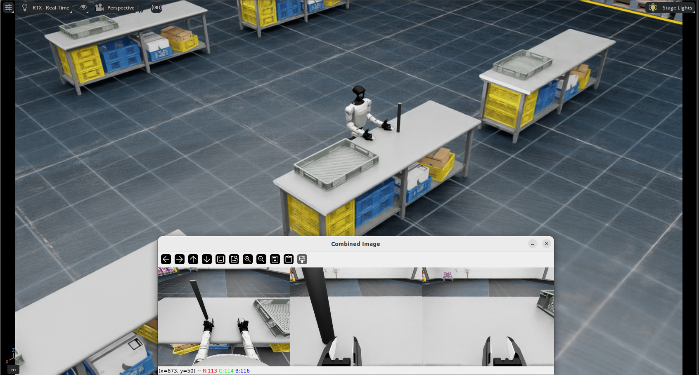
      <br/>
      <code>Isaac-PickPlace-Cylinder-G129-Dex1-Joint</code>
    </td>
    <td align="center">
      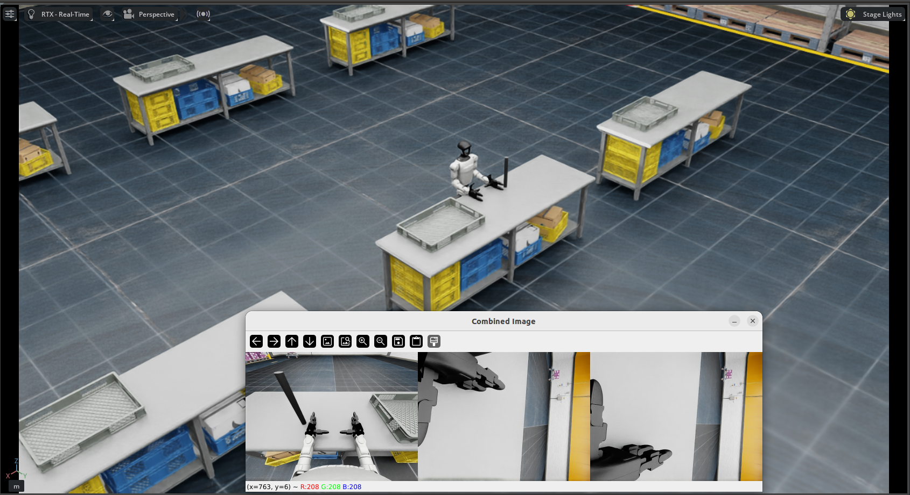
      <br/>
      <code>Isaac-PickPlace-Cylinder-G129-Dex3-Joint</code>
    </td>
    <td align="center">
      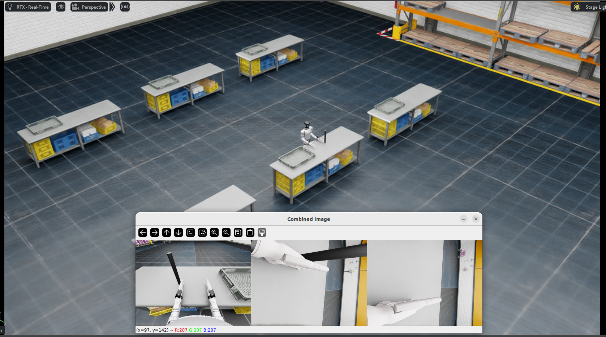
      <br/>
      <code>Isaac-PickPlace-Cylinder-G129-Inspire-Joint</code>
    </td>
    <td align="center">
      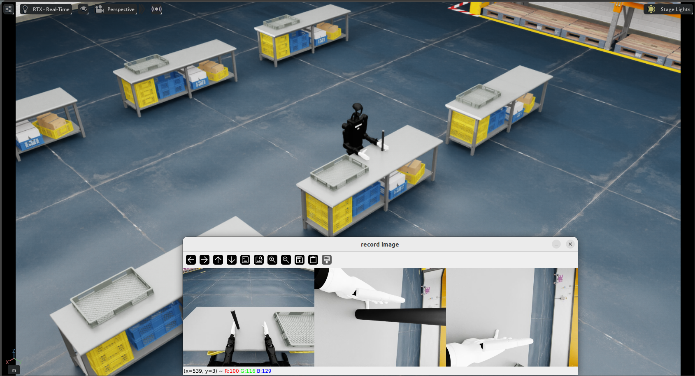
      <br/>
      <code>Isaac-PickPlace-Cylinder-H12-27dof-Inspire-Joint</code>
    </td>
  </tr>
  <tr>
    <td align="center">
      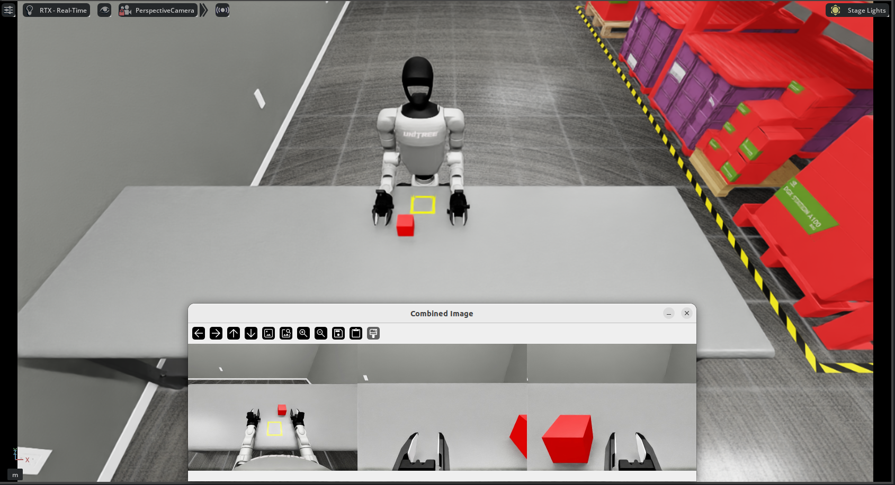
      <br/>
      <code>Isaac-PickPlace-RedBlock-G129-Dex1-Joint</code>
    </td>
    <td align="center">
      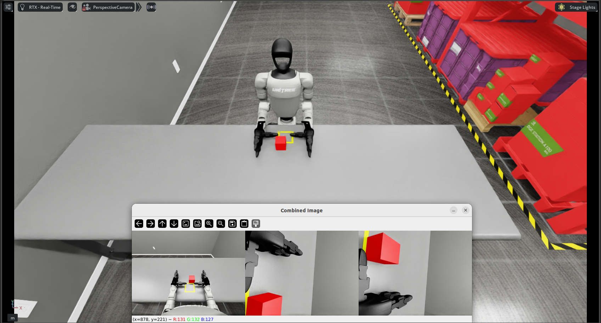
      <br/>
      <code>Isaac-PickPlace-RedBlock-G129-Dex3-Joint</code>
    </td>
    <td align="center">
      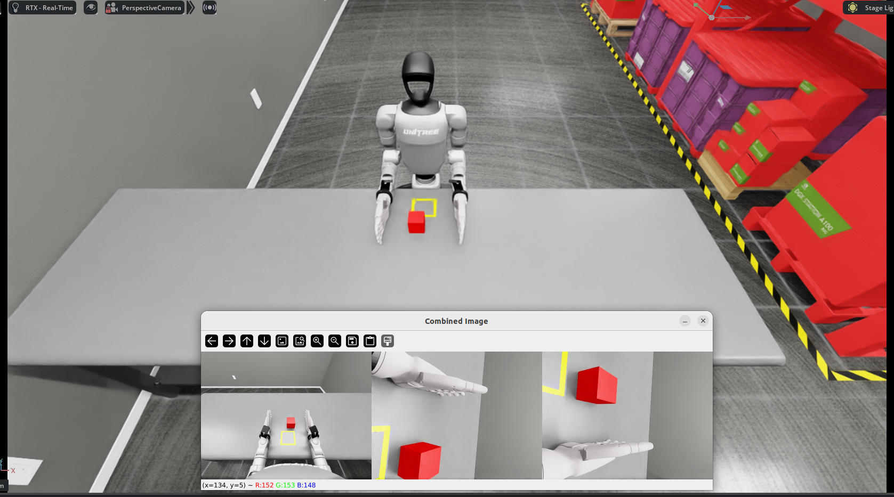
      <br/>
      <code>Isaac-PickPlace-RedBlock-G129-Inspire-Joint</code>
    </td>
    <td align="center">
      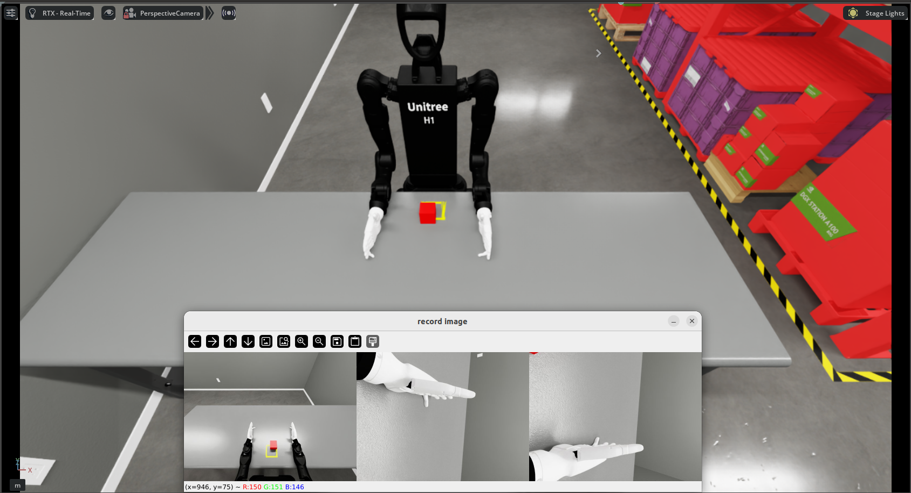
      <br/>
      <code>Isaac-PickPlace-RedBlock-H12-27dof-Inspire-Joint</code>
    </td>
  </tr>
  <tr>
    <td align="center">
      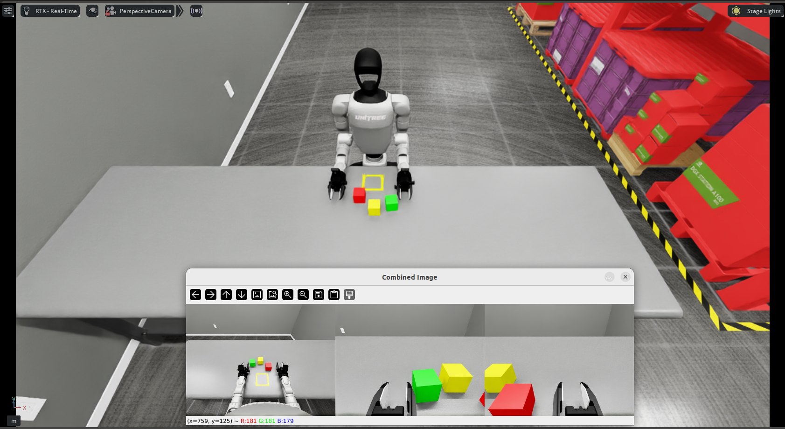
      <br/>
      <code>Isaac-Stack-RgyBlock-G129-Dex1-Joint</code>
    </td>
    <td align="center">
      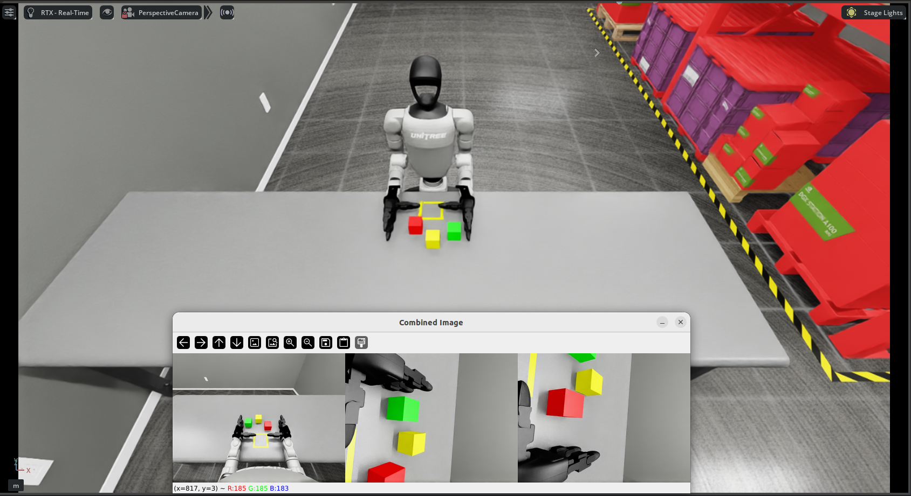
      <br/>
      <code>Isaac-Stack-RgyBlock-G129-Dex3-Joint</code>
    </td>
    <td align="center">
      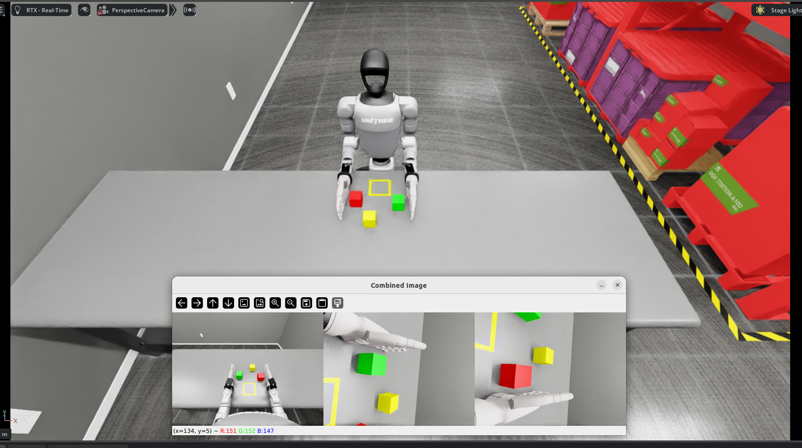
      <br/>
      <code>Isaac-Stack-RgyBlock-G129-Inspire-Joint</code>
    </td>
    <td align="center">
      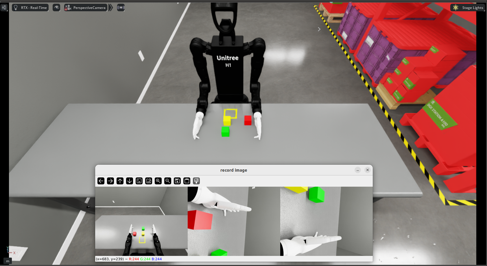
      <br/>
      <code> Isaac-Stack-RgyBlock-H12-27dof-Inspire-Joint</code>
    </td>
  </tr>
    <tr>
    <td align="center">
      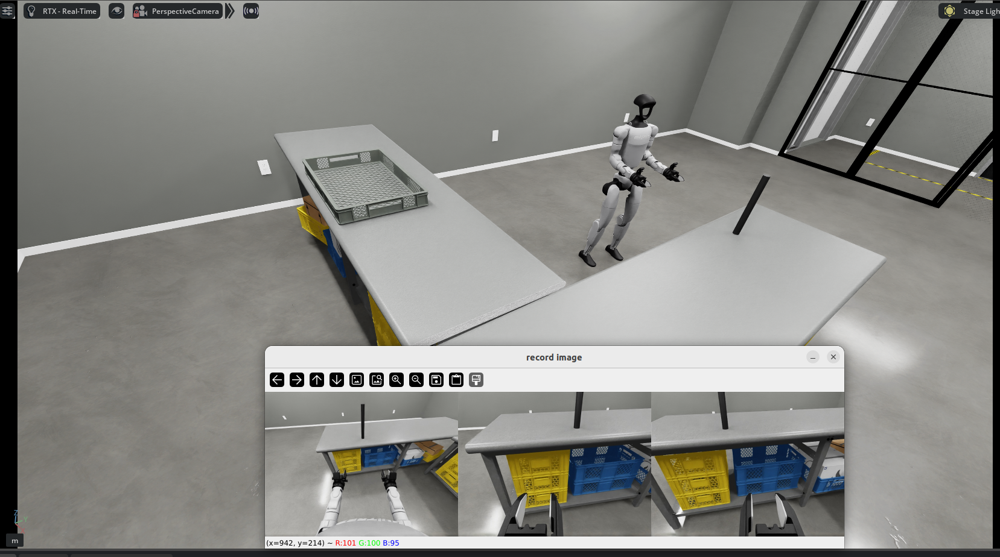
      <br/>
      <code>Isaac-Move-Cylinder-G129-Dex1-Wholebody</code>
    </td>
    <td align="center">
      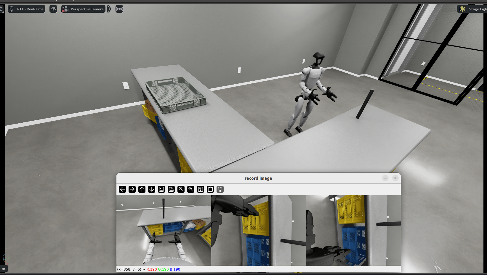
      <br/>
      <code>Isaac-Move-Cylinder-G129-Dex3-Wholebody</code>
    </td>
    <td align="center">
      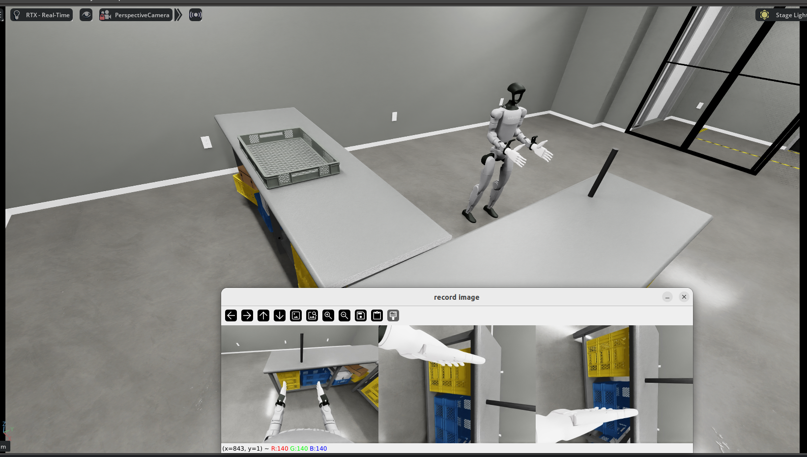
      <br/>
      <code>Isaac-Move-Cylinder-G129-Inspire-Wholebody</code>
    </td>
  </tr>
</table>

## 2、⚙️ 环境配置与运行
该项目需要安装Isaac Sim 4.5.0/Isaac Sim 5.x.0以及Isaac Lab，具体安装可参考[官方教程](https://isaac-sim.github.io/IsaacLab/main/source/setup/installation/pip_installation.html).或者按照下面流程进行安装。Ubuntu 20.4与Ubuntu 22.4以及以上版本安装方式不同，请根据自己的系统版本以及显卡资源进行安装。

### 2.1 Isaac Sim 4.5.0相关环境安装

环境的安装可以采用下面两种方式进行：

- 使用 `auto_setup_env.sh` 脚本进行自动安装
```
chmod +x auto_setup_env.sh
bash auto_setup_env.sh 4.5 unitree_sim_env
```

- 参考下面文档进行安装 
  
请参考<a href="doc/isaacsim4.5_install_zh.md"> isaacsim 4.5.0 环境安装步骤 </a> 进行环境安装

### 2.2 Isaac Sim 5.0.0/5.1.0相关环境安装
环境的安装可以采用下面两种方式进行：

- 使用 `auto_setup_env.sh` 脚本进行自动安装
```
chmod +x auto_setup_env.sh
bash auto_setup_env.sh 5.0 unitree_sim_env 
或者 
bash auto_setup_env.sh 5.1 unitree_sim_env
```
- 参考下面文档进行安装 

请参考<a href="doc/isaacsim5.0_install_zh.md"> isaacsim 5.0.0 环境安装步骤 </a> ，<a href="doc/isaacsim5.1_install_zh.md"> isaacsim 5.1.0 环境安装步骤 </a> 进行环境安装

**推荐：** 使用`auto_setup_env.sh`脚本进行自动安装环境与资产下载。

### 2.3 构建docker环境（使用的是Ubuntu22.04/IsaacSim 5.1）
#### 2.3.1 构建docker
```bash
sudo docker pull nvidia/cuda:12.2.0-runtime-ubuntu22.04
cd   unitree_sim_isaaclab
sudo docker build   --build-arg http_proxy=http://10.0.7.226:7890   --build-arg https_proxy=http://10.0.7.226:7890    -t unitree-sim:latest -f Dockerfile .
#  如果需要使用代理请填写- -build-arg http_proxy=http://127.0.0.1:7890   --build-arg https_proxy=http://127.0.0.1:7890

```
#### 2.3.2 进入docker

```shell
xhost +local:docker

sudo docker run --gpus all -it --rm   --network host   -e NVIDIA_VISIBLE_DEVICES=all   -e NVIDIA_DRIVER_CAPABILITIES=compute,utility,video,graphics,display   -e LD_LIBRARY_PATH=/usr/local/nvidia/lib:/usr/local/nvidia/lib64:$LD_LIBRARY_PATH   -e DISPLAY=$DISPLAY   -e VK_ICD_FILENAMES=/etc/vulkan/icd.d/nvidia_icd.json   -v /etc/vulkan/icd.d:/etc/vulkan/icd.d:ro   -v /usr/share/vulkan/icd.d:/usr/share/vulkan/icd.d:ro   -v /tmp/.X11-unix:/tmp/.X11-unix:rw   -v /home/unitree/newDisk/unitree_sim_isaaclab_usds:/home/code/isaacsim_assets   unitree-sim /bin/bash

#其中 -v /home/unitree/newDisk/unitree_sim_isaaclab_usds:/home/code/isaacsim_assets 是把宿主机中的unitree_sim_isaaclab_usds目录映射到docker容器的isaacsim_assets中，方便进行数据的共享，请根据自己情况修改。

```
### 2.4 运行程序

#### 2.4.1 资产下载

使用下面的命令下载需要的资产文件

```
sudo apt update

sudo apt install git-lfs

. fetch_assets.sh
```

#### 2.4.2 遥操作

```
python sim_main.py --device cpu  --enable_cameras  --task  Isaac-PickPlace-Cylinder-G129-Dex1-Joint    --enable_dex1_dds --robot_type g129
```

- `--task:` 任务名称，对应上表中的任务名称
- `--enable_dex1_dds/--enable_dex3_dds:` 分别代表启用二指夹爪/三指灵巧手的dds
- `--robot_type:` 机器人类型，目前有29自由度的unitree g1(g129),27自由度的H1-2
- `--no_render:` 不启动Sim窗口下运行并且开启WebRTC视频流, 如果使用Docker环境进行运行请添加此参数; 可以使用isaacsim-webrtc-streaming-client进行查看画面

**注意 1:** 如需要控制机器人移动，请参考`send_commands_8bit.py` 或者 `send_commands_keyboard.py` 发布控制命令，也可以直接使用。但是请注意只有带有`Wholebody`标识的才是移动型任务，才能控制机器人移动。

**注意 2:** isaacsim-webrtc-streaming-client 是isaacsim提供的一个用于查看Sim窗口画面的工具，具体安装和使用可参考[官方教程](https://docs.isaacsim.omniverse.nvidia.com/6.0.0/installation/manual_livestream_clients.html).

#### 2.4.3 数据回放

```
python sim_main.py --device cpu  --enable_cameras  --task Isaac-Stack-RgyBlock-G129-Dex1-Joint     --enable_dex1_dds --robot_type g129 --replay  --file_path "/home/unitree/Code/xr_teleoperate/teleop/utils/data" 
```
- `--replay:` 用于判断是否进行数据回放
- `--file_path:` 数据集存放的目录(请修改自己的数据集路径)。

**注意：** 这里使用的数据集存放格式是与[xr_teleoperate](https://github.com/unitreerobotics/xr_teleoperate)遥操作录制的数据集格式一致。

**注意:** 针对任务离散的Reward可以使用 'get_step_reward_value' 函数获取
#### 2.4.4 数据生成
通过在数据回放过程中调整光照条件和相机参数，并重新采集图像数据，可用于生成具有多样化视觉特征的增强数据，从而提升模型的泛化能力。

```
 python sim_main.py --device cpu  --enable_cameras  --task Isaac-Stack-RgyBlock-G129-Dex1-Joint     --enable_dex1_dds --robot_type g129 --replay  --file_path "/home/unitree/Code/xr_teleoperate/teleop/utils/data" --generate_data --generate_data_dir "./data2"
```
- `--generate_data:` 是否生成新的数据
- `--generate_data_dir:` 新数据存放的路径
- `--rerun_log:` 是否开启数据录制日志
- `--modify_light:` 是否修改光照条件(这个需要自己根据需求修改main函数中update_light的参数)
- `--modify_camera:` 是否修改相机参数(这个需要自己根据需求修改main函数中batch_augment_cameras_by_name参数)

**注意:** 如需要修改光照条件或者相机参数，请修改需要的参数并且测试后再进行大量生成。

**注意：** 如果使用sim和xr_teleoperate配合进行数据采集，需要修改xr_teleoperate中关于image_server的IP地址为sim启动的IP地址。


## 3、任务场景搭建

### 3.1 代码结构

```
unitree_sim_isaaclab/
│
├── action_provider                   [动作提供者,提供了读取文件动作、接收dds动作、策略生成动作等接口，目前主要使用基于DDS的动作获取]
│
├── dds                               [dds通信模块，实现了g1、夹爪、三指灵巧手的DDS通信]
│
├── image_server                      [图像发布服务，采用ZMQ进行图像发布]
│
├── layeredcontrol                    [底层控制模块，获取action并且设置到虚拟环境中]
│
├── robots                            [机器人的基础配置]
│
├── tasks                             [存放任务相关文件]
│   ├── common_config
│   │     ├── camera_configs.py       [相机放置相关配置]
│   │     ├── robot_configs.py        [机器人设置相关配置]
│   │
│   ├── common_event
│   │      ├── event_manager.py       [事件注册管理]  
│   │
│   ├── common_observations
│   │      ├── camera_state.py        [相机数据获取]  
│   │      ├── dex3_state.py          [三指灵巧手数据获取]
│   │      ├── g1_29dof_state.py      [机器人状态数据获取]
│   │      ├── gripper_state.py       [夹爪数据获取]
│   │
│   ├── common_scene                
│   │      ├── base_scene_pickplace_cylindercfg.py         [抓取圆柱体任务的公共场景]  
│   │      ├── base_scene_pickplace_redblock.py            [抓取红色木块任务的公共场景] 
│   │
│   ├── common_termination                                 [不同任务的物体是否超出规定工作范围的判断]
│   │      ├── base_termination_pick_place_cylinder         
│   │      ├── base_termination_pick_place_redblock          
│   │
│   ├── g1_tasks                                            [存放g1相关的所有任务]
│   │      ├── pick_place_cylinder_g1_29dof_dex1            [圆柱体抓取任务]
│   │      │     ├── mdp                                      
│   │      │     │     ├── observations.py                  [观测数据]
│   │      │     │     ├── terminations.py                  [终止判断条件]
│   │      │     ├── __init__.py                            [任务名称注册]  
│   │      │     ├── pickplace_cylinder_g1_29dof_dex1_joint_env_cfg.py           [任务具体的场景导入以及相关类的初始化]
│   │      ├── ...
│   │      ├── __init__.py                                  [对外显示g1中存在的所有任务名称]
│   ├── utils                                               [工具函数]
├── tools                                                   [存放usd转换和修改相关工具]
├── usd                                                     [存放usd的模型文件]
├── sim_main.py                                             [主函数] 
├── reset_pose_test.py                                      [物体位置重置的测试函数] 
```

### 3.2 任务场景搭建步骤
如果使用已有的机器人配置（G1-29dof-gripper、G1-29dof-dex3）搭建新任务场景只需要按照下面步骤进行操作即可：

#### 3.2.1、搭建任务场景的公共部分（即除机器人之外的其他场景）
按照已有的任务配置，在common_scene 目录下添加新任务的公共场景配置，可参考已有的任务的公共配置文件。
#### 3.2.2 终止或物体重置的条件判断
在common_termination目录中根据自己场景的需要添加终止或者物体重置的判断条件
#### 3.2.3 添加并注册任务
在 g1_tasks 目录下添加新任务的目录并且仿照已有的任务进行修改相关文件，下面以pick_place_cylinder_g1_29dof_dex1任务为例，具体如下：

- observations.py：添加对应的观测函数，只需要按照需求导入对应的文件即可
 ```

# Copyright (c) 2025, Unitree Robotics Co., Ltd. All Rights Reserved.
# License: Apache License, Version 2.0  
from tasks.common_observations.g1_29dof_state import get_robot_boy_joint_states
from tasks.common_observations.gripper_state import get_robot_gipper_joint_states
from tasks.common_observations.camera_state import get_camera_image

# ensure functions can be accessed by external modules
__all__ = [
    "get_robot_boy_joint_states",
    "get_robot_gipper_joint_states", 
    "get_camera_image"
]

 ```
- terminations.py：添加对应的条件判断函数，从common_termination导入对应文件
 ```
 from tasks.common_termination.base_termination_pick_place_cylinder import reset_object_estimate
__all__ = [
"reset_object_estimate"
]
 ```

- pick_place_cylinder_g1_29dof_dex1/```__init__.py ```

在新任务的目录下添加```__init__.py ```并且添加任务名称，如pick_place_cylinder_g1_29dof_dex1下面的```__init__.py``` 

```
# Copyright (c) 2025, Unitree Robotics Co., Ltd. All Rights Reserved.
# License: Apache License, Version 2.0  

import gymnasium as gym

from . import pickplace_cylinder_g1_29dof_dex1_joint_env_cfg


gym.register(
    id="Isaac-PickPlace-Cylinder-G129-Dex1-Joint",
    entry_point="isaaclab.envs:ManagerBasedRLEnv",
    kwargs={
        "env_cfg_entry_point": pickplace_cylinder_g1_29dof_dex1_joint_env_cfg.PickPlaceG129DEX1BaseFixEnvCfg,
    },
    disable_env_checker=True,
)


```
- 编写任务对应的环境配置文件，如 pickplace_cylinder_g1_29dof_dex1_joint_env_cfg.py

导入公共的场景，设置机器人的位置以及添加相机等配置

- 修改g1_tasks/```__init__.py```

按照下面方式把新任务的配置类添加到g1_tasks目录下的```__init__.py```的文件中。

```
# Copyright (c) 2025, Unitree Robotics Co., Ltd. All Rights Reserved.
# License: Apache License, Version 2.0  
"""Unitree G1 robot task module
contains various task implementations for the G1 robot, such as pick and place, motion control, etc.
"""

# use relative import
from . import pick_place_cylinder_g1_29dof_dex3
from . import pick_place_cylinder_g1_29dof_dex1
from . import pick_place_redblock_g1_29dof_dex1
from . import pick_place_redblock_g1_29dof_dex3
# export all modules
__all__ = ["pick_place_cylinder_g1_29dof_dex3", "pick_place_cylinder_g1_29dof_dex1", "pick_place_redblock_g1_29dof_dex1", "pick_place_redblock_g1_29dof_dex3"]

```
### 📋 TODO List

- ⬜ 持续添加新的任务场景
- ⬜ 持续进行代码优化

## 🙏 鸣谢
该代码基于以下开源代码库构建。请访问以下链接查看各自的许可证：

1. https://github.com/isaac-sim/IsaacLab
2. https://github.com/isaac-sim/IsaacSim
3. https://github.com/zeromq/pyzmq
4. https://github.com/unitreerobotics/unitree_sdk2_python
